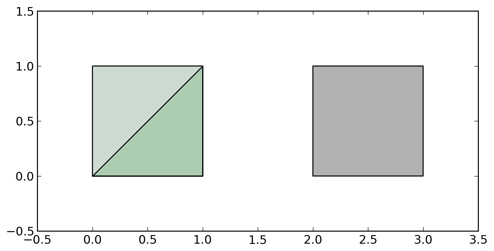
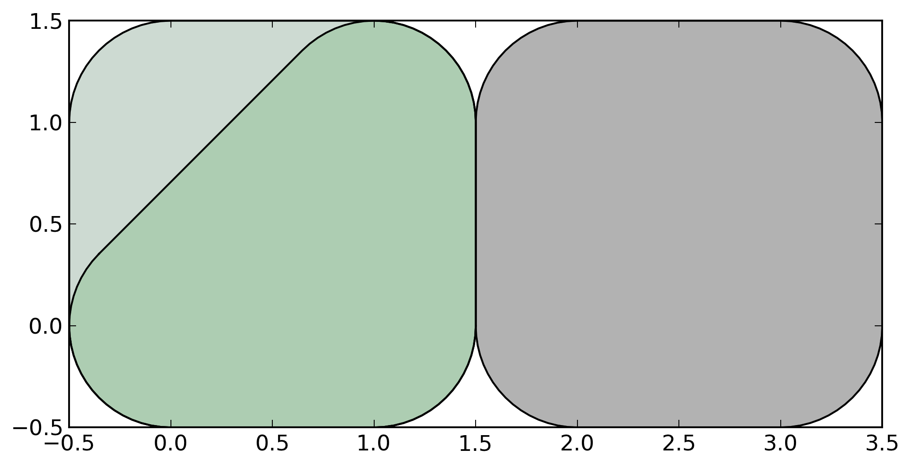
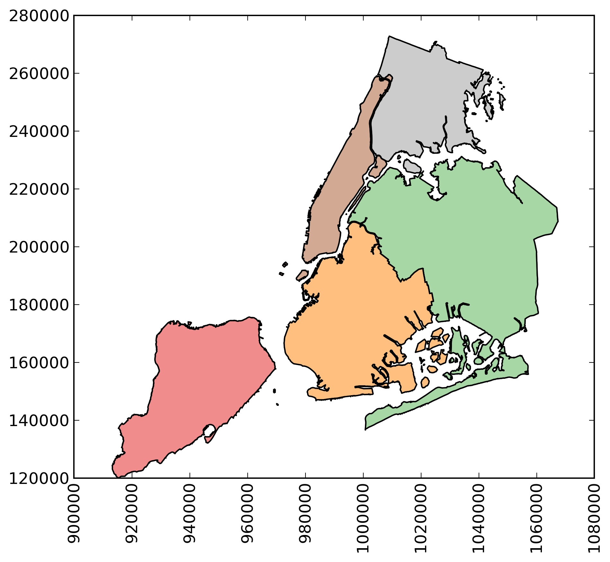
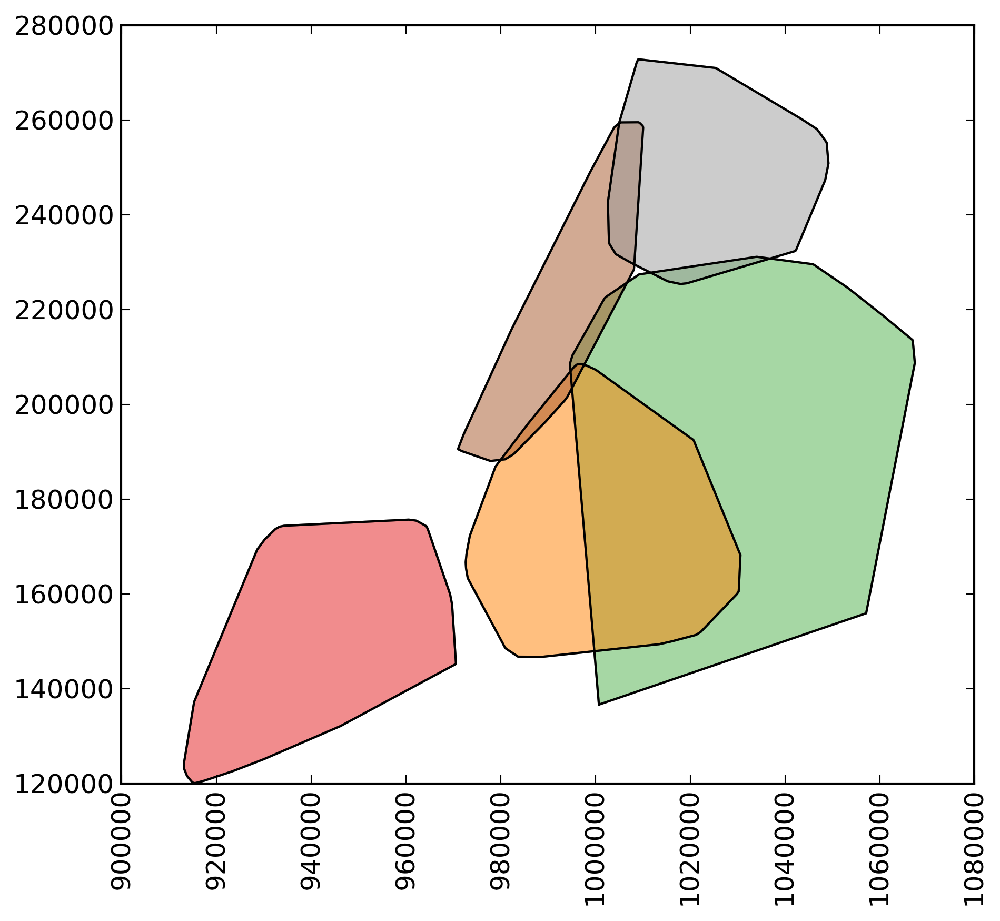

GeoPandas
---------

Python tools for geographic data

Introduction
------------

GeoPandas is a project to add support for geographic data to
[pandas](http://pandas.pydata.org) objects.  It currently implements
`GeoSeries` and `GeoDataFrame` types which are subclasses of
`pandas.Series` and `pandas.DataFrame` respectively.  GeoPandas
objects can act on [shapely](http://shapely.readthedocs.io/en/latest/)
geometry objects and perform geometric operations.

GeoPandas geometry operations are cartesian.  The coordinate reference
system (crs) can be stored as an attribute on an object, and is
automatically set when loading from a file.  Objects may be
transformed to new coordinate systems with the `to_crs()` method.
There is currently no enforcement of like coordinates for operations,
but that may change in the future.

Documentation is available at [geopandas.org](http://geopandas.org)
(current release) and
[Read the Docs](http://geopandas.readthedocs.io/en/latest/)
(release and development versions).

[//]: # (numfocus-fiscal-sponsor-attribution)

The GeoPandas project uses an [open governance model](https://github.com/geopandas/governance/blob/main/Governance.md)
and is fiscally sponsored by [NumFOCUS](https://numfocus.org/). Consider making
a [tax-deductible donation](https://numfocus.org/donate-for-geopandas) to help the project
pay for developer time, professional services, travel, workshops, and a variety of other needs.

  

 

Install
--------

See the [installation docs](https://geopandas.readthedocs.io/en/latest/install.html)
for all details. GeoPandas depends on the following packages:

- ``pandas``
- ``shapely``
- ``pyogrio``
- ``pyproj``
- ``packaging``

Further, ``matplotlib`` is an optional dependency, required for plotting.
Those packages depend on several low-level libraries for geospatial analysis, which can be a challenge to install. Therefore, we recommend to install GeoPandas using the [conda package manager](https://conda.io/en/latest/). See the [installation docs](https://geopandas.readthedocs.io/en/latest/install.html) for more details.

Get in touch
------------

- Ask usage questions ("How do I?") on [StackOverflow](https://stackoverflow.com/questions/tagged/geopandas) or [GIS StackExchange](https://gis.stackexchange.com/questions/tagged/geopandas).
- Get involved in [discussions on GitHub](https://github.com/geopandas/geopandas/discussions)
- Report bugs, suggest features or view the source code [on GitHub](https://github.com/geopandas/geopandas).
- For a quick question about a bug report or feature request, or Pull Request, head over to the [gitter channel](https://gitter.im/geopandas/geopandas).
- For less well defined questions or ideas, or to announce other projects of interest to GeoPandas users, ... use the [mailing list](https://groups.google.com/forum/#!forum/geopandas).

Examples
--------

    >>> import geopandas
    >>> from shapely.geometry import Polygon
    >>> p1 = Polygon([(0, 0), (1, 0), (1, 1)])
    >>> p2 = Polygon([(0, 0), (1, 0), (1, 1), (0, 1)])
    >>> p3 = Polygon([(2, 0), (3, 0), (3, 1), (2, 1)])
    >>> g = geopandas.GeoSeries([p1, p2, p3])
    >>> g
    0         POLYGON ((0 0, 1 0, 1 1, 0 0))
    1    POLYGON ((0 0, 1 0, 1 1, 0 1, 0 0))
    2    POLYGON ((2 0, 3 0, 3 1, 2 1, 2 0))
    dtype: geometry

Some geographic operations return normal pandas objects.  The `area` property of a `GeoSeries` will return a `pandas.Series` containing the area of each item in the `GeoSeries`:

    >>> print(g.area)
    0    0.5
    1    1.0
    2    1.0
    dtype: float64

Other operations return GeoPandas objects:

    >>> g.buffer(0.5)
    0    POLYGON ((-0.3535533905932737 0.35355339059327...
    1    POLYGON ((-0.5 0, -0.5 1, -0.4975923633360985 ...
    2    POLYGON ((1.5 0, 1.5 1, 1.502407636663901 1.04...
    dtype: geometry

GeoPandas objects also know how to plot themselves. GeoPandas uses
[matplotlib](http://matplotlib.org) for plotting. To generate a plot of a
`GeoSeries`, use:

    >>> g.plot()

GeoPandas also implements alternate constructors that can read any data format recognized by [pyogrio](http://pyogrio.readthedocs.io/en/latest/). To read a zip file containing an ESRI shapefile with the [boroughs boundaries of New York City](https://data.cityofnewyork.us/City-Government/Borough-Boundaries/tqmj-j8zm) (the example can be fetched using the [`geodatasets`](https://geodatasets.readthedocs.io/en/latest/) package):

    >>> import geodatasets
    >>> nybb_path = geodatasets.get_path('nybb')
    >>> boros = geopandas.read_file(nybb_path)
    >>> boros.set_index('BoroCode', inplace=True)
    >>> boros.sort_index(inplace=True)
    >>> boros
                   BoroName     Shape_Leng    Shape_Area  \
    BoroCode
    1             Manhattan  359299.096471  6.364715e+08
    2                 Bronx  464392.991824  1.186925e+09
    3              Brooklyn  741080.523166  1.937479e+09
    4                Queens  896344.047763  3.045213e+09
    5         Staten Island  330470.010332  1.623820e+09

                                                       geometry
    BoroCode
    1         MULTIPOLYGON (((981219.0557861328 188655.31579...
    2         MULTIPOLYGON (((1012821.805786133 229228.26458...
    3         MULTIPOLYGON (((1021176.479003906 151374.79699...
    4         MULTIPOLYGON (((1029606.076599121 156073.81420...
    5         MULTIPOLYGON (((970217.0223999023 145643.33221...

    >>> boros['geometry'].convex_hull
    BoroCode
    1    POLYGON ((977855.4451904297 188082.3223876953,...
    2    POLYGON ((1017949.977600098 225426.8845825195,...
    3    POLYGON ((988872.8212280273 146772.0317993164,...
    4    POLYGON ((1000721.531799316 136681.776184082, ...
    5    POLYGON ((915517.6877458114 120121.8812543372,...
    dtype: geometry

