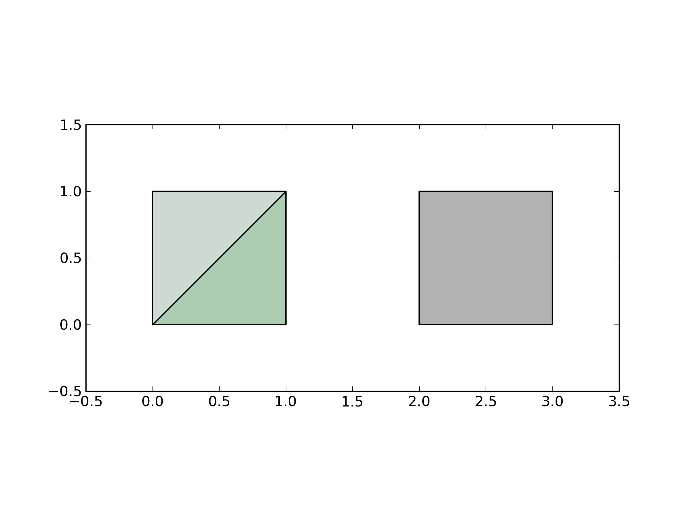
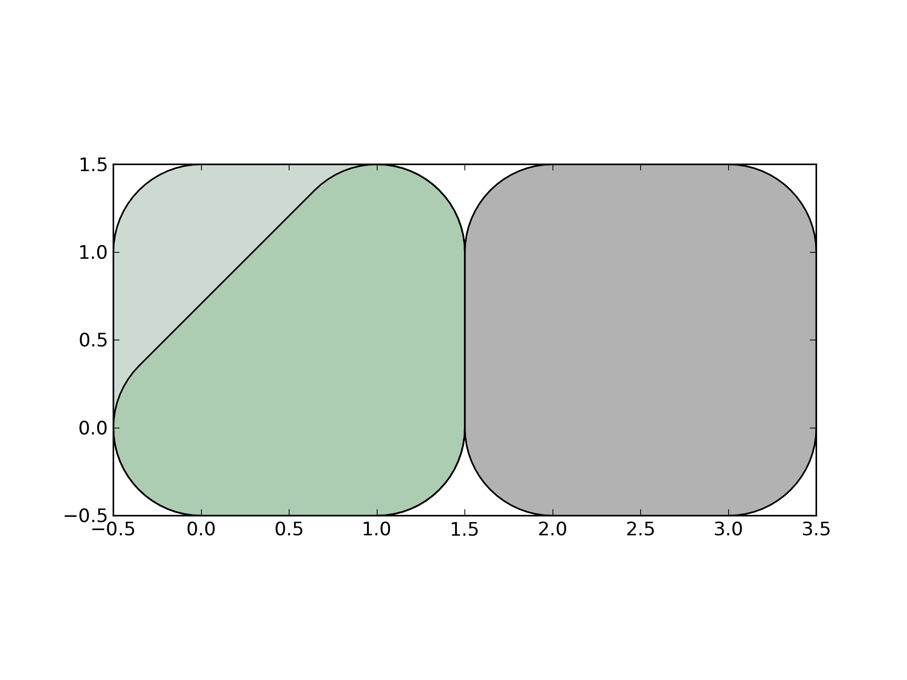
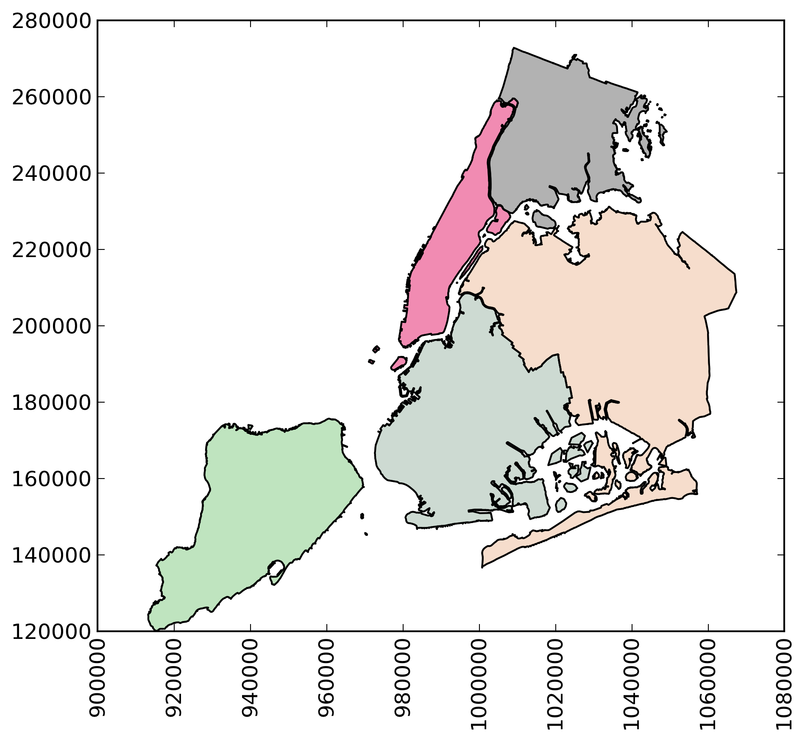
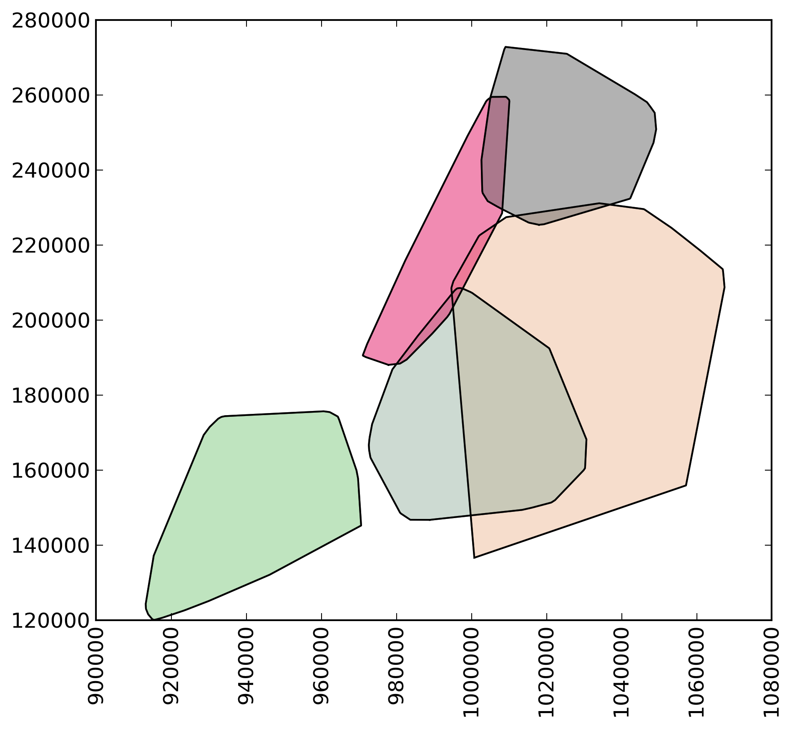

GeoPandas     
=========

Python tools for geographic data

Introduction
------------

GeoPandas is a project to add support for geographic data to
[pandas](http://pandas.pydata.org) objects.  It currently implements
`GeoSeries` and `GeoDataFrame` types which are subclasses of
`pandas.Series` and `pandas.DataFrame` respectively.  GeoPandas
objects can act on [shapely](http://shapely.readthedocs.io/en/latest/)
geometry objects and perform geometric operations.

GeoPandas geometry operations are cartesian.  The coordinate reference
system (crs) can be stored as an attribute on an object, and is
automatically set when loading from a file.  Objects may be
transformed to new coordinate systems with the `to_crs()` method.
There is currently no enforcement of like coordinates for operations,
but that may change in the future.

Documentation is available at [geopandas.org](http://geopandas.org)
(current release) and
[Read the Docs](http://geopandas.readthedocs.io/en/latest/)
(release and development versions).

Install
--------

See the [installation docs](https://geopandas.readthedocs.io/en/latest/install.html)
for all details. GeoPandas depends on the following packages:

- ``pandas``
- ``shapely``
- ``fiona``
- ``pyproj``

Further, ``descartes`` and ``matplotlib`` are optional dependencies, required
for plotting, and [``rtree``](https://github.com/Toblerity/rtree) is an optional
dependency, required for spatial joins. ``rtree`` requires the C library [``libspatialindex``](https://github.com/libspatialindex/libspatialindex).

Those packages depend on several low-level libraries for geospatial analysis, which can be a challenge to install. Therefore, we recommend to install GeoPandas using the [conda package manager](https://conda.io/en/latest/). See the [installation docs](https://geopandas.readthedocs.io/en/latest/install.html) for more details.

Get in touch
------------

- Ask usage questions ("How do I?") on [StackOverflow](https://stackoverflow.com/questions/tagged/geopandas) or [GIS StackExchange](https://gis.stackexchange.com/questions/tagged/geopandas).
- Report bugs, suggest features or view the source code [on GitHub](https://github.com/geopandas/geopandas).
- For a quick question about a bug report or feature request, or Pull Request, head over to the [gitter channel](https://gitter.im/geopandas/geopandas).
- For less well defined questions or ideas, or to announce other projects of interest to GeoPandas users, ... use the [mailing list](https://groups.google.com/forum/#!forum/geopandas).

Examples
--------

    >>> p1 = Polygon([(0, 0), (1, 0), (1, 1)])
    >>> p2 = Polygon([(0, 0), (1, 0), (1, 1), (0, 1)])
    >>> p3 = Polygon([(2, 0), (3, 0), (3, 1), (2, 1)])
    >>> g = geopandas.GeoSeries([p1, p2, p3])
    >>> g
    0    POLYGON ((0.0000000000000000 0.000000000000000...
    1    POLYGON ((0.0000000000000000 0.000000000000000...
    2    POLYGON ((2.0000000000000000 0.000000000000000...
    dtype: object

Some geographic operations return normal pandas object.  The `area` property of a `GeoSeries` will return a `pandas.Series` containing the area of each item in the `GeoSeries`:

    >>> print g.area
    0    0.5
    1    1.0
    2    1.0
    dtype: float64

Other operations return GeoPandas objects:

    >>> g.buffer(0.5)
    Out[15]:
    0    POLYGON ((-0.3535533905932737 0.35355339059327...
    1    POLYGON ((-0.5000000000000000 0.00000000000000...
    2    POLYGON ((1.5000000000000000 0.000000000000000...
    dtype: object

GeoPandas objects also know how to plot themselves.  GeoPandas uses [descartes](https://pypi.python.org/pypi/descartes) to generate a [matplotlib](http://matplotlib.org) plot. To generate a plot of our GeoSeries, use:

    >>> g.plot()

GeoPandas also implements alternate constructors that can read any data format recognized by [fiona](http://fiona.readthedocs.io/en/latest/). To read a zip file containing an ESRI shapefile with the [boroughs boundaries of New York City](https://data.cityofnewyork.us/City-Government/Borough-Boundaries/tqmj-j8zm) (GeoPandas includes this as an example dataset):

    >>> nybb_path = geopandas.datasets.get_path('nybb')
    >>> boros = geopandas.read_file(nybb_path)
    >>> boros.set_index('BoroCode', inplace=True)
    >>> boros.sort()
    >>> boros
                   BoroName    Shape_Area     Shape_Leng  \
    BoroCode
    1             Manhattan  6.364422e+08  358532.956418
    2                 Bronx  1.186804e+09  464517.890553
    3              Brooklyn  1.959432e+09  726568.946340
    4                Queens  3.049947e+09  861038.479299
    5         Staten Island  1.623853e+09  330385.036974

                                                       geometry
    BoroCode
    1         (POLYGON ((981219.0557861328125000 188655.3157...
    2         (POLYGON ((1012821.8057861328125000 229228.264...
    3         (POLYGON ((1021176.4790039062500000 151374.796...
    4         (POLYGON ((1029606.0765991210937500 156073.814...
    5         (POLYGON ((970217.0223999023437500 145643.3322...

    >>> boros['geometry'].convex_hull
    0    POLYGON ((915517.6877458114176989 120121.88125...
    1    POLYGON ((1000721.5317993164062500 136681.7761...
    2    POLYGON ((988872.8212280273437500 146772.03179...
    3    POLYGON ((977855.4451904296875000 188082.32238...
    4    POLYGON ((1017949.9776000976562500 225426.8845...
    dtype: object

