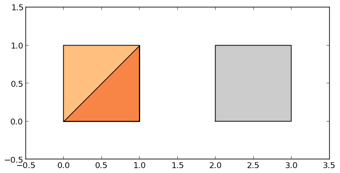
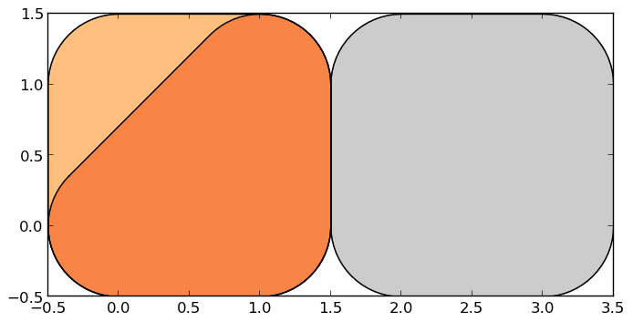
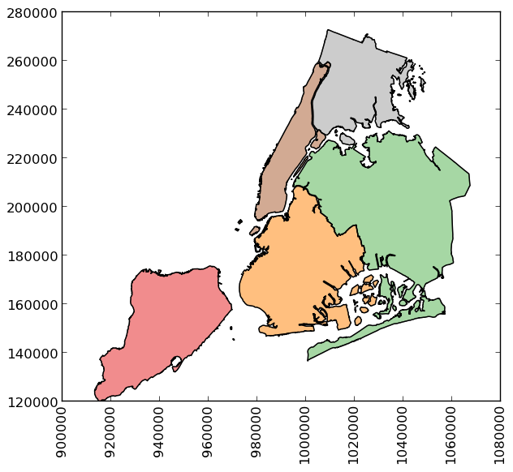
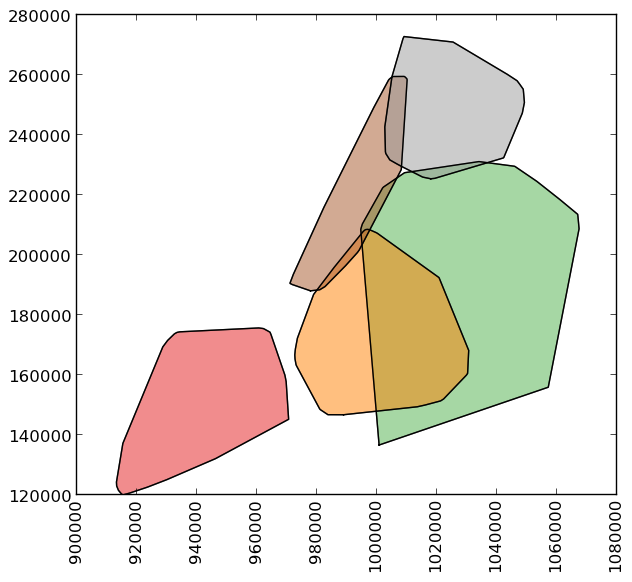

Documentation
=============

GeoPandas implements two main data structures, a ``GeoSeries`` and a
``GeoDataFrame``.  These are subclasses of pandas ``Series`` and
``DataFrame``, respectively.

GeoSeries
---------

A ``GeoSeries`` contains a sequence of geometries.

The ``GeoSeries`` class implements nearly all of the attributes and
methods of Shapely objects.  When applied to a ``GeoSeries``, they
will apply elementwise to all geometries in the series.  Binary
operations can be applied between two ``GeoSeries``, in which case the
operation is carried out elementwise.  The two series will be aligned
by matching indices.  Binary operations can also be applied to a
single geometry, in which case the operation is carried out for each
element of the series with that geometry.  In either case, a
``Series`` or a ``GeoSeries`` will be returned, as appropriate.

The following Shapely methods and attributes are available on
``GeoSeries`` objects:

.. attribute:: GeoSeries.area

  Returns a ``Series`` containing the area of each geometry in the ``GeoSeries``.

.. attribute:: GeoSeries.bounds

  Returns a ``DataFrame`` with columns ``minx``, ``miny``, ``maxx``,
  ``maxy`` values containing the bounds for each geometry.
  NOTE: This behavior may change in future versions.

.. attribute:: GeoSeries.length

  Returns a ``Series`` containing the length of each geometry.

.. attribute:: GeoSeries.geom_type

  Returns a ``Series`` of strings specifying the `Geometry Type` of
  each object.

.. method:: GeoSeries.distance(other)

  Returns a ``Series`` containing the minimum distance to the `other`
  ``GeoSeries`` (elementwise) or geometric object.

.. method:: GeoSeries.representative_point()

  Returns a ``GeoSeries`` of (cheaply computed) points that are
  guaranteed to be within each geometry.

.. attribute:: GeoSeries.exterior

  Returns a ``GeoSeries`` of LinearRings representing the outer
  boundary of each polygon in the GeoSeries.  (Applies to GeoSeries
  containing only Polygons).

.. attribute:: GeoSeries.interiors

  Returns a ``GeoSeries`` of InteriorRingSequences representing the
  inner rings of each polygon in the GeoSeries.  (Applies to GeoSeries
  containing only Polygons).

`Unary Predicates`

.. attribute:: GeoSeries.is_empty

  Returns a ``Series`` of ``dtype('bool')`` with value ``True`` for
  empty geometries.

.. attribute:: GeoSeries.is_ring

  Returns a ``Series`` of ``dtype('bool')`` with value ``True`` for
  features that are closed.

.. attribute:: GeoSeries.is_simple

  Returns a ``Series`` of ``dtype('bool')`` with value ``True`` for
  geometries that do not cross themselves (meaningful only for
  `LineStrings` and `LinearRings`).

.. attribute:: GeoSeries.is_valid

  Returns a ``Series`` of ``dtype('bool')`` with value ``True`` for
  geometries that are valid.

`Binary Predicates`

.. method:: GeoSeries.almost_equals(other[, decimal=6])

  Returns a ``Series`` of ``dtype('bool')`` with value ``True`` if
  each object is approximately equal to the `other` at all
  points to specified `decimal` place precision.  (See also :meth:`equals`)

.. method:: GeoSeries.contains(other)

  Returns a ``Series`` of ``dtype('bool')`` with value ``True`` if
  each object's `interior` contains the `boundary` and
  `interior` of the other object and their boundaries do not touch at all.

.. method:: GeoSeries.crosses(other)

  Returns a ``Series`` of ``dtype('bool')`` with value ``True`` if
  the `interior` of each object intersects the `interior` of
  the other but does not contain it, and the dimension of the intersection is
  less than the dimension of the one or the other.

.. method:: GeoSeries.disjoint(other)

  Returns a ``Series`` of ``dtype('bool')`` with value ``True`` if
  the `boundary` and `interior` of each object does not
  intersect at all with those of the other.

.. method:: GeoSeries.equals(other)

  Returns a ``Series`` of ``dtype('bool')`` with value ``True`` if
  if the set-theoretic `boundary`, `interior`, and `exterior`
  of each object coincides with those of the other.

.. method:: GeoSeries.intersects(other)

  Returns a ``Series`` of ``dtype('bool')`` with value ``True`` if
  if the `boundary` and `interior` of each object intersects in
  any way with those of the other.

.. method:: GeoSeries.touches(other)

  Returns a ``Series`` of ``dtype('bool')`` with value ``True`` if
  the objects have at least one point in common and their
  interiors do not intersect with any part of the other.

.. method:: GeoSeries.within(other)

  Returns a ``Series`` of ``dtype('bool')`` with value ``True`` if
  each object's `boundary` and `interior` intersect only
  with the `interior` of the other (not its `boundary` or `exterior`).
  (Inverse of :meth:`contains`)

`Set-theoretic Methods`

.. attribute:: GeoSeries.boundary

  Returns a ``GeoSeries`` of lower dimensional objects representing
  each geometries's set-theoretic `boundary`.

.. attribute:: GeoSeries.centroid

  Returns a ``GeoSeries`` of points for each geometric centroid.

.. method:: GeoSeries.difference(other)

  Returns a ``GeoSeries`` of the points in each geometry that
  are not in the *other* object.

.. method:: GeoSeries.intersection(other)

  Returns a ``GeoSeries`` of the intersection of each object with the `other`
  geometric object.

.. method:: GeoSeries.symmetric_difference(other)

  Returns a ``GeoSeries`` of the points in each object not in the `other`
  geometric object, and the points in the `other` not in this object.

.. method:: GeoSeries.union(other)

  Returns a ``GeoSeries`` of the union of points from each object and the
  `other` geometric object.

`Constructive Methods`

.. method:: GeoSeries.buffer(distance, resolution=16)

  Returns a ``GeoSeries`` of geometries representing all points within a given `distance`
  of each geometric object.

.. attribute:: GeoSeries.convex_hull

  Returns a ``GeoSeries`` of geometries representing the smallest
  convex `Polygon` containing all the points in each object unless the
  number of points in the object is less than three. For two points,
  the convex hull collapses to a `LineString`; for 1, a `Point`.

.. attribute:: GeoSeries.envelope

  Returns a ``GeoSeries`` of geometries representing the point or
  smallest rectangular polygon (with sides parallel to the coordinate
  axes) that contains each object.

.. method:: GeoSeries.simplify(tolerance, preserve_topology=True)

  Returns a ``GeoSeries`` containing a simplified representation of
  each object.

`Aggregating methods`

.. attribute:: GeoSeries.unary_union

  Return a geometry containing the union of all geometries in the ``GeoSeries``.

Additionally, the following methods are implemented:

.. method:: GeoSeries.from_file()

  Load a ``GeoSeries`` from a file from any format recognized by
  `fiona`_.

.. method:: GeoSeries.plot(colormap='Set1')

  Generate a plot of the geometries in the ``GeoSeries``.
  ``colormap`` can be any recognized by matplotlib, but discrete
  colormaps such as ``Accent``, ``Dark2``, ``Paired``, ``Pastel1``,
  ``Pastel2``, ``Set1``, ``Set2``, or ``Set3`` are recommended.

Methods of pandas ``Series`` objects are also available, although not
all are applicable to geometric objects and some may return a
``Series`` rather than a ``GeoSeries`` result.  The methods
``copy()``, ``align()``, ``isnull()`` and ``fillna()`` have been
implemented specifically for ``GeoSeries`` and are expected to work
correctly.

GeoDataFrame
------------

A ``GeoDataFrame`` is a tablular data structure that contains a column
called ``geometry`` which contains a `GeoSeries``.

Currently only the following methods are implemented for a ``GeoDataFrame``:

.. method:: GeoDataFrame.from_file()

  Load a ``GeoDataFrame`` from a file from any format recognized by
  `fiona`_.

.. method:: GeoDataFrame.plot()

  Generate a plot of the geometries in the ``GeoDataFrame``.
  Currently calls ``GeoSeries.plot()`` on the ``geometry`` column,
  though in the future this will be able to color the geometries by
  data values from another column.

All pandas ``DataFrame`` methods are also available, although they may
not operate in a meaningful way on the ``geometry`` column and may not
return a ``GeoDataFrame`` result even when it would be appropriate to
do so.

Examples
--------

.. sourcecode:: python

    >>> p1 = Polygon([(0, 0), (1, 0), (1, 1)])
    >>> p2 = Polygon([(0, 0), (1, 0), (1, 1), (0, 1)])
    >>> p3 = Polygon([(2, 0), (3, 0), (3, 1), (2, 1)])
    >>> g = GeoSeries([p1, p2, p3])
    >>> g
    0    POLYGON ((0.0000000000000000 0.000000000000000...
    1    POLYGON ((0.0000000000000000 0.000000000000000...
    2    POLYGON ((2.0000000000000000 0.000000000000000...
    dtype: object

Some geographic operations return normal pandas object.  The ``area`` property of a ``GeoSeries`` will return a ``pandas.Series`` containing the area of each item in the ``GeoSeries``:

.. sourcecode:: python

    >>> print g.area
    0    0.5
    1    1.0
    2    1.0
    dtype: float64

Other operations return GeoPandas objects:

.. sourcecode:: python

    >>> g.buffer(0.5)
    Out[15]:
    0    POLYGON ((-0.3535533905932737 0.35355339059327...
    1    POLYGON ((-0.5000000000000000 0.00000000000000...
    2    POLYGON ((1.5000000000000000 0.000000000000000...
    dtype: object

GeoPandas objects also know how to plot themselves.  GeoPandas uses `descartes`_ to generate a `matplotlib`_ plot. To generate a plot of our GeoSeries, use:

.. sourcecode:: python

    >>> g.plot()

GeoPandas also implements alternate constructors that can read any data format recognized by `fiona`_.  To read a `file containing the boroughs of New York City`_:

.. sourcecode:: python

    >>> boros = GeoDataFrame.from_file('nybb.shp')
    >>> boros.set_index('BoroCode', inplace=True)
    >>> boros.sort()
    >>> boros
                   BoroName    Shape_Area     Shape_Leng  \
    BoroCode
    1             Manhattan  6.364422e+08  358532.956418
    2                 Bronx  1.186804e+09  464517.890553
    3              Brooklyn  1.959432e+09  726568.946340
    4                Queens  3.049947e+09  861038.479299
    5         Staten Island  1.623853e+09  330385.036974
    
                                                       geometry
    BoroCode
    1         (POLYGON ((981219.0557861328125000 188655.3157...
    2         (POLYGON ((1012821.8057861328125000 229228.264...
    3         (POLYGON ((1021176.4790039062500000 151374.796...
    4         (POLYGON ((1029606.0765991210937500 156073.814...
    5         (POLYGON ((970217.0223999023437500 145643.3322...

 
.. sourcecode:: python

    >>> boros['geometry'].convex_hull
    0    POLYGON ((915517.6877458114176989 120121.88125...
    1    POLYGON ((1000721.5317993164062500 136681.7761...
    2    POLYGON ((988872.8212280273437500 146772.03179...
    3    POLYGON ((977855.4451904296875000 188082.32238...
    4    POLYGON ((1017949.9776000976562500 225426.8845...
    dtype: object

.. _Descartes: https://pypi.python.org/pypi/descartes
.. _matplotlib: http://matplotlib.org
.. _fiona: http://toblerity.github.io/fiona
.. _file containing the boroughs of New York City: http://www.nyc.gov/html/dcp/download/bytes/nybb_13a.zip

.. toctree::
   :maxdepth: 2

