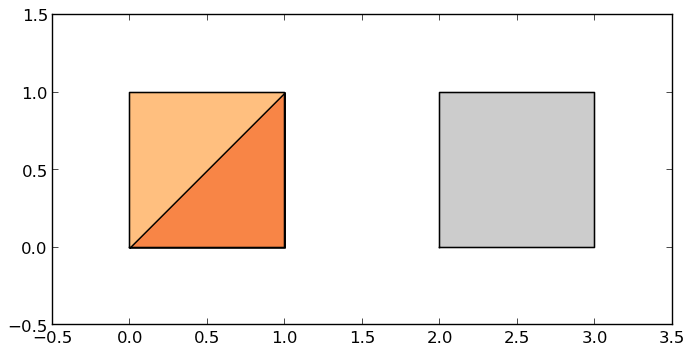
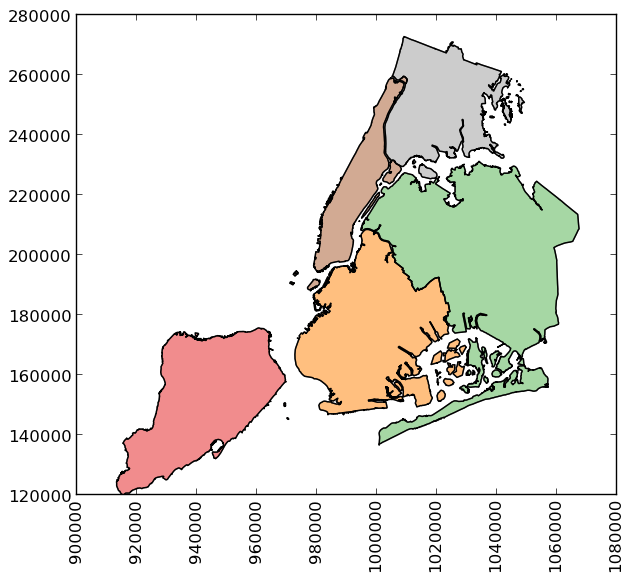
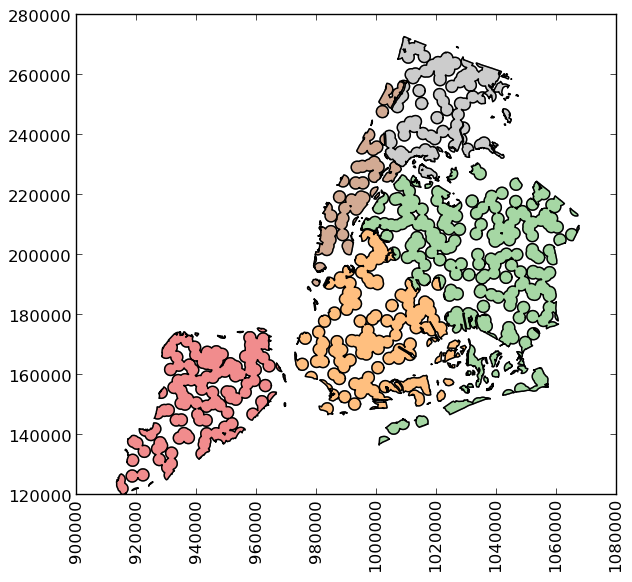

.. _geometric_manipulations:

Geometric manipulations
========================

GeoPandas makes available all the tools for geometric manipulations in the `Shapely library <http://shapely.readthedocs.io/en/latest/manual.html>`_.

Note that documentation for all set-theoretic tools for creating new shapes using the relationship between two different spatial datasets -- like creating intersections, or differences -- can be found at :doc:`Set operations with overlay <set_operations>`.

Constructive methods
~~~~~~~~~~~~~~~~~~~~

.. method:: GeoSeries.buffer(distance, resolution=16)

  Returns a :class:`~geopandas.GeoSeries` of geometries representing all points within a given `distance`
  of each geometric object.

.. attribute:: GeoSeries.boundary

  Returns a :class:`~geopandas.GeoSeries` of lower dimensional objects representing
  each geometry's set-theoretic `boundary`.

.. attribute:: GeoSeries.centroid

  Returns a :class:`~geopandas.GeoSeries` of points for each geometric centroid.

.. attribute:: GeoSeries.concave_hull

  Returns a :class:`~geopandas.GeoSeries` of geometries representing the smallest
  concave `Polygon` containing all the points in each object unless the
  number of points in the object is less than three. For two points,
  the concave hull collapses to a `LineString`; for 1, a `Point`.

.. attribute:: GeoSeries.convex_hull

  Returns a :class:`~geopandas.GeoSeries` of geometries representing the smallest
  convex `Polygon` containing all the points in each object unless the
  number of points in the object is less than three. For two points,
  the convex hull collapses to a `LineString`; for 1, a `Point`.

.. method:: GeoSeries.delaunay_triangles(tolerance, preserve_topology=True)

  Returns a :class:`~geopandas.GeoSeries` consisting of polygons (default) or linestrings
  (`only_edges=True`) representing the computed Delaunay triangulation around the vertices
  of an input geometry.

.. attribute:: GeoSeries.envelope

  Returns a :class:`~geopandas.GeoSeries` of geometries representing the point or
  smallest rectangular polygon (with sides parallel to the coordinate
  axes) that contains each object.

.. method:: GeoSeries.extract_unique_points

  Returns a :class:`~geopandas.GeoSeries` of geometries containing all distinct
  vertices of each input geometry as a multipoint.

.. method:: GeoSeries.offset_curve(distance, quad_segs=8, join_style="round", mitre_limit=5.0)

  Returns a :class:`~geopandas.GeoSeries` containing a `Linestring` or `MultiLineString`
  geometry at a distance from the object on its right or its left side.

.. method:: GeoSeries.remove_repeated_points

   Returns a :class:`~geopandas.GeoSeries` containing a copy of the input geometry
   with repeated points removed.

.. method:: GeoSeries.simplify(tolerance, preserve_topology=True)

  Returns a :class:`~geopandas.GeoSeries` containing a simplified representation of
  each object.

.. method:: GeoSeries.segmentize(max_segment_length)

  Returns a :class:`~geopandas.GeoSeries` with additional vertices added to line
  segments based on max_segment_length.

.. method:: GeoSeries.union_all()

  Return a geometry containing the union of all geometries in the :class:`~geopandas.GeoSeries`.

Affine transformations
~~~~~~~~~~~~~~~~~~~~~~~~

.. method:: GeoSeries.affine_transform(self, matrix)

  Transform the geometries of the :class:`~geopandas.GeoSeries` using an affine transformation matrix

.. method:: GeoSeries.rotate(self, angle, origin='center', use_radians=False)

  Rotate the coordinates of the :class:`~geopandas.GeoSeries`.

.. method:: GeoSeries.scale(self, xfact=1.0, yfact=1.0, zfact=1.0, origin='center')

 Scale the geometries of the :class:`~geopandas.GeoSeries` along each (x, y, z) dimension.

.. method:: GeoSeries.skew(self, angle, origin='center', use_radians=False)

  Shear/Skew the geometries of the :class:`~geopandas.GeoSeries` by angles along x and y dimensions.

.. method:: GeoSeries.translate(self, xoff=0.0, yoff=0.0, zoff=0.0)

  Shift the coordinates of the :class:`~geopandas.GeoSeries`.

Examples of geometric manipulations
~~~~~~~~~~~~~~~~~~~~~~~~~~~~~~~~~~~

.. sourcecode:: python

    >>> import geopandas
    >>> from geopandas import GeoSeries
    >>> from shapely.geometry import Polygon
    >>> p1 = Polygon([(0, 0), (1, 0), (1, 1)])
    >>> p2 = Polygon([(0, 0), (1, 0), (1, 1), (0, 1)])
    >>> p3 = Polygon([(2, 0), (3, 0), (3, 1), (2, 1)])
    >>> g = GeoSeries([p1, p2, p3])
    >>> g
    0         POLYGON ((0 0, 1 0, 1 1, 0 0))
    1    POLYGON ((0 0, 1 0, 1 1, 0 1, 0 0))
    2    POLYGON ((2 0, 3 0, 3 1, 2 1, 2 0))
    dtype: geometry

Some geographic operations return normal pandas objects.  The :attr:`~geopandas.GeoSeries.area` property of a :class:`~geopandas.GeoSeries` will return a :class:`pandas.Series` containing the area of each item in the :class:`~geopandas.GeoSeries`:

.. sourcecode:: python

    >>> print(g.area)
    0    0.5
    1    1.0
    2    1.0
    dtype: float64

Other operations return GeoPandas objects:

.. sourcecode:: python

    >>> g.buffer(0.5)
    0    POLYGON ((-0.3535533905932737 0.35355339059327...
    1    POLYGON ((-0.5 0, -0.5 1, -0.4975923633360985 ...
    2    POLYGON ((1.5 0, 1.5 1, 1.502407636663901 1.04...
    dtype: geometry

.. image:: ../../_static/test_buffer.png

GeoPandas objects also know how to plot themselves. GeoPandas uses `matplotlib`_ for plotting. To generate a plot of a :class:`~geopandas.GeoSeries`, use:

.. sourcecode:: python

    >>> g.plot()

GeoPandas also implements alternate constructors that can read any data format recognized by `Pyogrio`_.  To read a zip file containing an ESRI shapefile with the `borough boundaries of New York City`_ (provided by the ``geodatasets`` package):

.. sourcecode:: python

    >>> import geodatasets
    >>> nybb_path = geodatasets.get_path('nybb')
    >>> boros = geopandas.read_file(nybb_path)
    >>> boros.set_index('BoroCode', inplace=True)
    >>> boros.sort_index(inplace=True)
    >>> boros
                   BoroName     Shape_Leng    Shape_Area  \
    BoroCode
    1             Manhattan  359299.096471  6.364715e+08
    2                 Bronx  464392.991824  1.186925e+09
    3              Brooklyn  741080.523166  1.937479e+09
    4                Queens  896344.047763  3.045213e+09
    5         Staten Island  330470.010332  1.623820e+09

                                                       geometry
    BoroCode
    1         MULTIPOLYGON (((981219.0557861328 188655.31579...
    2         MULTIPOLYGON (((1012821.805786133 229228.26458...
    3         MULTIPOLYGON (((1021176.479003906 151374.79699...
    4         MULTIPOLYGON (((1029606.076599121 156073.81420...
    5         MULTIPOLYGON (((970217.0223999023 145643.33221...

.. sourcecode:: python

    >>> boros['geometry'].convex_hull
    BoroCode
    1    POLYGON ((977855.4451904297 188082.3223876953,...
    2    POLYGON ((1017949.977600098 225426.8845825195,...
    3    POLYGON ((988872.8212280273 146772.0317993164,...
    4    POLYGON ((1000721.531799316 136681.776184082, ...
    5    POLYGON ((915517.6877458114 120121.8812543372,...
    dtype: geometry

.. image:: ../../_static/nyc_hull.png

To demonstrate a more complex operation, generate a
:class:`~geopandas.GeoSeries` containing 2000 random points:

.. sourcecode:: python

    >>> import numpy as np
    >>> from shapely.geometry import Point
    >>> xmin, xmax, ymin, ymax = 900000, 1080000, 120000, 280000
    >>> xc = (xmax - xmin) * np.random.random(2000) + xmin
    >>> yc = (ymax - ymin) * np.random.random(2000) + ymin
    >>> pts = GeoSeries([Point(x, y) for x, y in zip(xc, yc)])

Now draw a circle with fixed radius around each point:

.. sourcecode:: python

    >>> circles = pts.buffer(2000)

You can collapse these circles into a single :class:`MultiPolygon`
geometry with

.. sourcecode:: python

    >>> mp = circles.union_all()

To extract the part of this geometry contained in each borough, you can
just use:

.. sourcecode:: python

    >>> holes = boros['geometry'].intersection(mp)

and to get the area outside of the holes:

.. sourcecode:: python

    >>> boros_with_holes = boros['geometry'].difference(mp)

.. image:: ../../_static/boros_with_holes.png

Note that this can be simplified a bit, since ``geometry`` is
available as an attribute on a :class:`~geopandas.GeoDataFrame`, and the
:meth:`~geopandas.GeoSeries.intersection` and :meth:`~geopandas.GeoSeries.difference` methods are implemented with the
"&" and "-" operators, respectively.  For example, the latter could
have been expressed simply as ``boros.geometry - mp``.

It's easy to do things like calculate the fractional area in each
borough that are in the holes:

.. sourcecode:: python

    >>> holes.area / boros.geometry.area
    BoroCode
    1    0.579939
    2    0.586833
    3    0.608174
    4    0.582172
    5    0.558075
    dtype: float64

.. _matplotlib: http://matplotlib.org
.. _pyogrio: http://pyogrio.readthedocs.io/en/latest/
.. _geopy: https://github.com/geopy/geopy
.. _geo_interface: https://gist.github.com/sgillies/2217756
.. _borough boundaries of New York City: https://data.cityofnewyork.us/City-Government/Borough-Boundaries/tqmj-j8zm

.. toctree::
   :maxdepth: 2
