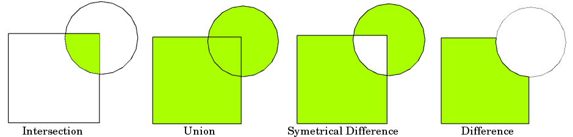

.. currentmodule:: geopandas

.. ipython:: python
   :suppress:

   import geopandas
   import matplotlib.pyplot as plt
   plt.close('all')

Set operations with overlay
============================

When working with multiple spatial datasets -- especially multiple *polygon* or
*line* datasets -- users often wish to create new shapes based on places where
those datasets overlap (or don't overlap). These manipulations are often
referred using the language of sets -- intersections, unions, and differences.
These types of operations are made available in the GeoPandas library through
the :meth:`~geopandas.GeoDataFrame.overlay` method.

The basic idea is demonstrated by the graphic below but keep in mind that
overlays operate at the DataFrame level, not on individual geometries, and the
properties from both are retained. In effect, for every shape in the left
:class:`~geopandas.GeoDataFrame`, this operation is executed against every other shape in the right
:class:`~geopandas.GeoDataFrame`:

**Source: QGIS documentation**

.. note::
   Note to users familiar with the *shapely* library: :meth:`~geopandas.GeoDataFrame.overlay` can be thought
   of as offering versions of the standard *shapely* set operations that deal with
   the complexities of applying set operations to two *GeoSeries*. The standard
   *shapely* set operations are also available as :class:`~geopandas.GeoSeries` methods.

The different overlay operations
--------------------------------

First, create some example data:

.. ipython:: python

    from shapely.geometry import Polygon
    polys1 = geopandas.GeoSeries([Polygon([(0,0), (2,0), (2,2), (0,2)]),
                                  Polygon([(2,2), (4,2), (4,4), (2,4)])])
    polys2 = geopandas.GeoSeries([Polygon([(1,1), (3,1), (3,3), (1,3)]),
                                  Polygon([(3,3), (5,3), (5,5), (3,5)])])

    df1 = geopandas.GeoDataFrame({'geometry': polys1, 'df1':[1,2]})
    df2 = geopandas.GeoDataFrame({'geometry': polys2, 'df2':[1,2]})

These two GeoDataFrames have some overlapping areas:

.. ipython:: python

    ax = df1.plot(color='red');
    @savefig overlay_example.png width=5in
    df2.plot(ax=ax, color='green', alpha=0.5);

The above example illustrates the different overlay modes.
The :meth:`~geopandas.GeoDataFrame.overlay` method will determine the set of all individual geometries
from overlaying the two input GeoDataFrames. This result covers the area covered
by the two input GeoDataFrames, and also preserves all unique regions defined by
the combined boundaries of the two GeoDataFrames.

.. note::
   For historical reasons, the overlay method is also available as a top-level function :func:`overlay`.
   It is recommended to use the method as the function may be deprecated in the future.

When using ``how='union'``, all those possible geometries are returned:

.. ipython:: python

    res_union = df1.overlay(df2, how='union')
    res_union

    ax = res_union.plot(alpha=0.5, cmap='tab10')
    df1.plot(ax=ax, facecolor='none', edgecolor='k');
    @savefig overlay_example_union.png width=5in
    df2.plot(ax=ax, facecolor='none', edgecolor='k');

The other ``how`` operations will return different subsets of those geometries.
With ``how='intersection'``, it returns only those geometries that are contained
by both GeoDataFrames:

.. ipython:: python

    res_intersection = df1.overlay(df2, how='intersection')
    res_intersection

    ax = res_intersection.plot(cmap='tab10')
    df1.plot(ax=ax, facecolor='none', edgecolor='k');
    @savefig overlay_example_intersection.png width=5in
    df2.plot(ax=ax, facecolor='none', edgecolor='k');

``how='symmetric_difference'`` is the opposite of ``'intersection'`` and returns
the geometries that are only part of one of the GeoDataFrames but not of both:

.. ipython:: python

    res_symdiff = df1.overlay(df2, how='symmetric_difference')
    res_symdiff

    ax = res_symdiff.plot(cmap='tab10')
    df1.plot(ax=ax, facecolor='none', edgecolor='k');
    @savefig overlay_example_symdiff.png width=5in
    df2.plot(ax=ax, facecolor='none', edgecolor='k');

To obtain the geometries that are part of ``df1`` but are not contained in
``df2``, you can use ``how='difference'``:

.. ipython:: python

    res_difference = df1.overlay(df2, how='difference')
    res_difference

    ax = res_difference.plot(cmap='tab10')
    df1.plot(ax=ax, facecolor='none', edgecolor='k');
    @savefig overlay_example_difference.png width=5in
    df2.plot(ax=ax, facecolor='none', edgecolor='k');

Finally, with ``how='identity'``, the result consists of the surface of ``df1``,
but with the geometries obtained from overlaying ``df1`` with ``df2``:

.. ipython:: python

    res_identity = df1.overlay(df2, how='identity')
    res_identity

    ax = res_identity.plot(cmap='tab10')
    df1.plot(ax=ax, facecolor='none', edgecolor='k');
    @savefig overlay_example_identity.png width=5in
    df2.plot(ax=ax, facecolor='none', edgecolor='k');

Overlay groceries example
-------------------------

First, load the Chicago community areas and groceries example datasets and select :

.. ipython:: python

    import geodatasets

    chicago = geopandas.read_file(geodatasets.get_path("geoda.chicago_commpop"))
    groceries = geopandas.read_file(geodatasets.get_path("geoda.groceries"))

    # Project to crs that uses meters as distance measure
    chicago = chicago.to_crs("ESRI:102003")
    groceries = groceries.to_crs("ESRI:102003")

To illustrate the :meth:`~geopandas.GeoDataFrame.overlay` method, consider the following case in which one
wishes to identify the "served" portion of each area -- defined as areas within
1km of a grocery store -- using a ``GeoDataFrame`` of community areas and a
``GeoDataFrame`` of groceries.

.. ipython:: python

    # Look at Chicago:
    @savefig chicago_basic.png width=5in
    chicago.plot();

    # Now buffer groceries to find area within 1km.
    # Check CRS -- USA Contiguous Albers Equal Area, units of meters.
    groceries.crs

    # make 1km buffer
    groceries['geometry']= groceries.buffer(1000)
    @savefig groceries_buffers.png width=5in
    groceries.plot();

To select only the portion of community areas within 1km of a grocery, specify the ``how`` option to be "intersect", which creates a new set of polygons where these two layers overlap:

.. ipython:: python

   chicago_cores = chicago.overlay(groceries, how='intersection')
   @savefig chicago_cores.png width=5in
   chicago_cores.plot(alpha=0.5, edgecolor='k', cmap='tab10');

Changing the ``how`` option allows for different types of overlay operations. For example, if you were interested in the portions of Chicago *far* from groceries (the peripheries), you would compute the difference of the two.

.. ipython:: python

   chicago_peripheries = chicago.overlay(groceries, how='difference')
   @savefig chicago_peripheries.png width=5in
   chicago_peripheries.plot(alpha=0.5, edgecolor='k', cmap='tab10');

.. ipython:: python
    :suppress:

    import matplotlib.pyplot as plt
    plt.close('all')

keep_geom_type keyword
----------------------

In default settings, :meth:`~geopandas.GeoDataFrame.overlay` returns only geometries of the same geometry type as GeoDataFrame
(left one) has, where Polygon and MultiPolygon is considered as a same type (other types likewise).
You can control this behavior using ``keep_geom_type`` option, which is set to
True by default. Once set to False, ``overlay`` will return all geometry types resulting from
selected set-operation. Different types can result for example from intersection of touching geometries,
where two polygons intersects in a line or a point.

More examples
-------------

A larger set of examples of the use of :meth:`~geopandas.GeoDataFrame.overlay` can be found `here <https://nbviewer.jupyter.org/github/geopandas/geopandas/blob/main/doc/source/gallery/overlays.ipynb>`_

.. toctree::
   :maxdepth: 2
