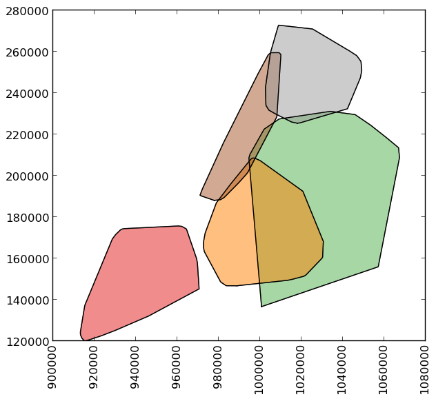

Geometric Manipulations
========================

*geopandas* makes available all the tools for geometric manipulations in the `*shapely* library <http://toblerity.org/shapely/manual.html>`_.

Note that documentation for all set-theoretic tools for creating new shapes using the relationship between two different spatial datasets -- like creating intersections, or differences -- can be found on the :doc:`set operations <set_operations>` page.

Constructive Methods
~~~~~~~~~~~~~~~~~~~~

.. method:: GeoSeries.buffer(distance, resolution=16)

  Returns a ``GeoSeries`` of geometries representing all points within a given `distance`
  of each geometric object.

.. attribute:: GeoSeries.boundary

  Returns a ``GeoSeries`` of lower dimensional objects representing
  each geometries's set-theoretic `boundary`.

.. attribute:: GeoSeries.centroid

  Returns a ``GeoSeries`` of points for each geometric centroid.

.. attribute:: GeoSeries.convex_hull

  Returns a ``GeoSeries`` of geometries representing the smallest
  convex `Polygon` containing all the points in each object unless the
  number of points in the object is less than three. For two points,
  the convex hull collapses to a `LineString`; for 1, a `Point`.

.. attribute:: GeoSeries.envelope

  Returns a ``GeoSeries`` of geometries representing the point or
  smallest rectangular polygon (with sides parallel to the coordinate
  axes) that contains each object.

.. method:: GeoSeries.simplify(tolerance, preserve_topology=True)

  Returns a ``GeoSeries`` containing a simplified representation of
  each object.

.. attribute:: GeoSeries.unary_union

  Return a geometry containing the union of all geometries in the ``GeoSeries``.

Affine transformations
~~~~~~~~~~~~~~~~~~~~~~~~

.. method:: GeoSeries.rotate(self, angle, origin='center', use_radians=False)

  Rotate the coordinates of the GeoSeries.

.. method:: GeoSeries.scale(self, xfact=1.0, yfact=1.0, zfact=1.0, origin='center')

 Scale the geometries of the GeoSeries along each (x, y, z) dimensio.

.. method:: GeoSeries.skew(self, angle, origin='center', use_radians=False)

  Shear/Skew the geometries of the GeoSeries by angles along x and y dimensions.

.. method:: GeoSeries.translate(self, angle, origin='center', use_radians=False)

  Shift the coordinates of the GeoSeries.

Examples of Geometric Manipulations
------------------------------------

.. sourcecode:: python

    >>> p1 = Polygon([(0, 0), (1, 0), (1, 1)])
    >>> p2 = Polygon([(0, 0), (1, 0), (1, 1), (0, 1)])
    >>> p3 = Polygon([(2, 0), (3, 0), (3, 1), (2, 1)])
    >>> g = GeoSeries([p1, p2, p3])
    >>> g
    0    POLYGON ((0.0000000000000000 0.000000000000000...
    1    POLYGON ((0.0000000000000000 0.000000000000000...
    2    POLYGON ((2.0000000000000000 0.000000000000000...
    dtype: object

.. image:: _static/test.png

Some geographic operations return normal pandas object.  The ``area`` property of a ``GeoSeries`` will return a ``pandas.Series`` containing the area of each item in the ``GeoSeries``:

.. sourcecode:: python

    >>> print g.area
    0    0.5
    1    1.0
    2    1.0
    dtype: float64

Other operations return GeoPandas objects:

.. sourcecode:: python

    >>> g.buffer(0.5)
    Out[15]:
    0    POLYGON ((-0.3535533905932737 0.35355339059327...
    1    POLYGON ((-0.5000000000000000 0.00000000000000...
    2    POLYGON ((1.5000000000000000 0.000000000000000...
    dtype: object

.. image:: _static/test_buffer.png

GeoPandas objects also know how to plot themselves.  GeoPandas uses `descartes`_ to generate a `matplotlib`_ plot. To generate a plot of our GeoSeries, use:

.. sourcecode:: python

    >>> g.plot()

GeoPandas also implements alternate constructors that can read any data format recognized by `fiona`_.  To read a zip file containing an ESRI shapefile with the `borough boundaries of New York City`_ (GeoPandas includes this as an example dataset):

.. sourcecode:: python

    >>> nybb_path = geopandas.datasets.get_path('nybb')
    >>> boros = GeoDataFrame.from_file(nybb_path)
    >>> boros.set_index('BoroCode', inplace=True)
    >>> boros.sort()
    >>> boros
                   BoroName    Shape_Area     Shape_Leng  \
    BoroCode
    1             Manhattan  6.364422e+08  358532.956418
    2                 Bronx  1.186804e+09  464517.890553
    3              Brooklyn  1.959432e+09  726568.946340
    4                Queens  3.049947e+09  861038.479299
    5         Staten Island  1.623853e+09  330385.036974

                                                       geometry
    BoroCode
    1         (POLYGON ((981219.0557861328125000 188655.3157...
    2         (POLYGON ((1012821.8057861328125000 229228.264...
    3         (POLYGON ((1021176.4790039062500000 151374.796...
    4         (POLYGON ((1029606.0765991210937500 156073.814...
    5         (POLYGON ((970217.0223999023437500 145643.3322...

.. image:: _static/nyc.png

.. sourcecode:: python

    >>> boros['geometry'].convex_hull
    0    POLYGON ((915517.6877458114176989 120121.88125...
    1    POLYGON ((1000721.5317993164062500 136681.7761...
    2    POLYGON ((988872.8212280273437500 146772.03179...
    3    POLYGON ((977855.4451904296875000 188082.32238...
    4    POLYGON ((1017949.9776000976562500 225426.8845...
    dtype: object

To demonstrate a more complex operation, we'll generate a
``GeoSeries`` containing 2000 random points:

.. sourcecode:: python

    >>> from shapely.geometry import Point
    >>> xmin, xmax, ymin, ymax = 900000, 1080000, 120000, 280000
    >>> xc = (xmax - xmin) * np.random.random(2000) + xmin
    >>> yc = (ymax - ymin) * np.random.random(2000) + ymin
    >>> pts = GeoSeries([Point(x, y) for x, y in zip(xc, yc)])

Now draw a circle with fixed radius around each point:

.. sourcecode:: python

    >>> circles = pts.buffer(2000)

We can collapse these circles into a single shapely MultiPolygon
geometry with

.. sourcecode:: python

    >>> mp = circles.unary_union

To extract the part of this geometry contained in each borough, we can
just use:

.. sourcecode:: python

    >>> holes = boros['geometry'].intersection(mp)

.. image:: _static/holes.png

and to get the area outside of the holes:

.. sourcecode:: python

    >>> boros_with_holes = boros['geometry'].difference(mp)

Note that this can be simplified a bit, since ``geometry`` is
available as an attribute on a ``GeoDataFrame``, and the
``intersection`` and ``difference`` methods are implemented with the
"&" and "-" operators, respectively.  For example, the latter could
have been expressed simply as ``boros.geometry - mp``.

It's easy to do things like calculate the fractional area in each
borough that are in the holes:

.. sourcecode:: python

    >>> holes.area / boros.geometry.area
    BoroCode
    1           0.602015
    2           0.523457
    3           0.585901
    4           0.577020
    5           0.559507
    dtype: float64

.. _Descartes: https://pypi.python.org/pypi/descartes
.. _matplotlib: http://matplotlib.org
.. _fiona: http://toblerity.github.io/fiona
.. _geopy: https://github.com/geopy/geopy
.. _geo_interface: https://gist.github.com/sgillies/2217756
.. _borough boundaries of New York City: https://data.cityofnewyork.us/City-Government/Borough-Boundaries/tqmj-j8zm

.. toctree::
   :maxdepth: 2
