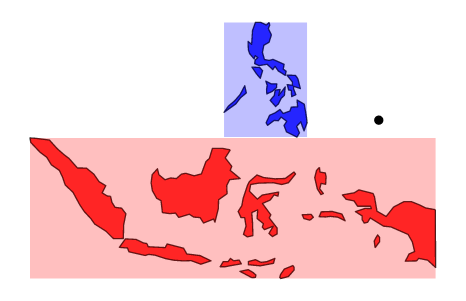

.. currentmodule:: {{ geopandas }}

Merging Data
=========================================

There are two ways to combine datasets in *geopandas* -- attribute joins and spatial joins.

In an attribute join, a ``GeoSeries`` or ``GeoDataFrame`` is combined with a regular *pandas* ``Series`` or ``DataFrame`` based on a common variable. This is analogous to normal merging or joining in *pandas*.

In a Spatial Join, observations from to ``GeoSeries`` or ``GeoDataFrames`` are combined based on their spatial relationship to one another.

In the following examples, we use these datasets:

.. ipython:: python

   world = geopandas.read_file(geopandas.datasets.get_path('naturalearth_lowres'))
   cities = geopandas.read_file(geopandas.datasets.get_path('naturalearth_cities'))

   # For attribute join
   country_shapes = world[['geometry', 'iso_a3']]
   country_names = world[['name', 'iso_a3']]

   # For spatial join
   countries = world[['geometry', 'name']]
   countries = countries.rename(columns={'name':'country'})

Attribute Joins
----------------

Attribute joins are accomplished using the ``merge`` method. In general, it is recommended to use the ``merge`` method called from the spatial dataset. With that said, the stand-alone ``merge`` function will work if the GeoDataFrame is in the ``left`` argument; if a DataFrame is in the ``left`` argument and a GeoDataFrame is in the ``right`` position, the result will no longer be a GeoDataFrame.

For example, consider the following merge that adds full names to a ``GeoDataFrame`` that initially has only ISO codes for each country by merging it with a *pandas* ``DataFrame``.

.. ipython:: python

   # `country_shapes` is GeoDataFrame with country shapes and iso codes
   country_shapes.head()

   # `country_names` is DataFrame with country names and iso codes
   country_names.head()

   # Merge with `merge` method on shared variable (iso codes):
   country_shapes = country_shapes.merge(country_names, on='iso_a3')
   country_shapes.head()

Spatial Joins
----------------

In a Spatial Join, two geometry objects are merged based on their spatial relationship to one another.
There are two types of spatial joins suppored in geopandas: binary operation joins (`sjoin`) and proximity joins (`sjoin_nearest`).
The binary predicate based `sjoin()` operates on the binary operations `intersects`, `within` and `contains`.
The proximity based `sjoin_nearest()` relies on distances, as reported by `shapely`'s `distance` method.

.. ipython:: python

   # One GeoDataFrame of countries, one of Cities.
   # Want to merge so we can get each city's country.
   countries.head()
   cities.head()

   # Execute spatial join

   cities_with_country = geopandas.sjoin(cities, countries, how="inner", op='intersects')
   cities_with_country.head()

   # Execute proximity spatial join

   cities_with_near_country = geopandas.sjoin_nearest(cities, countries, how="inner")
   cities_with_near_country.head()

Arguments Shared by All Spatial Joins
~~~~~~~~~~~~~~~~

**left_df** and **right_df**

GeoDataFrames to join.

**how**

The `how` argument specifies the type of join that will occur and which geometry is retained in the resultant geodataframe. It accepts the following options:

* ``left``: use the index from the first (or `left_df`) geodataframe that you provide to ``sjoin``; retain only the `left_df` geometry column
* ``right``: use index from second (or `right_df`); retain only the `right_df` geometry column
* ``inner``: use intersection of index values from both geodataframes; retain only the `left_df` geometry column

**l_suffix**

Suffix to apply to overlapping column names (left GeoDataFrame).
Ex: ``name`` -> ``name_left``.

**r_suffix**

Suffix to apply to overlapping column names (right GeoDataFrame).
Ex: ``name`` -> ``name_right``.

Binary Predicate ``sjoin`` Arguments
~~~~~~~~~~~~~~~~

``sjoin()`` has one additional argument:

**op**

The ``op`` argument specifies how ``geopandas`` decides whether or not to join the attributes of one object to another. There are three different join options as follows:

* ``intersects``: The attributes will be joined if the boundary and interior of the object intersect in any way with the boundary and/or interior of the other object.
* ``within``: The attributes will be joined if the object’s boundary and interior intersect *only* with the interior of the other object (not its boundary or exterior).
* ``contains``: The attributes will be joined if the object’s interior contains the boundary and interior of the other object and their boundaries do not touch at all.

You can read more about each join type in the `Shapely documentation <http://shapely.readthedocs.io/en/latest/manual.html#binary-predicates>`__.

Note more complicated spatial relationships can be studied by combining geometric operations with spatial join. To find all polygons within a given distance of a point, for example, one can first use the ``buffer`` method to expand each point into a circle of appropriate radius, then intersect those buffered circles with the polygons in question.

Binary Predicate ``sjoin`` Performance
~~~~~~~~~~~~~~~~~~

Existing spatial indexes on either ``left_df`` or ``right_df`` will be reused when performing an ``sjoin``. If neither df has a spatial index, a spatial index will be generated for the longer df. If both have a spatial index, the `right_df`'s index will be used preferentially. Performance of multiple sjoins in a row involving a common GeoDataFrame may be improved by pre-generating the spatial index of the common GeoDataFrame prior to performing sjoins using ``df1.sindex``.

.. code-block:: python

    df1 = # a GeoDataFrame with data
    df2 = # a second GeoDataFrame
    df3 = # a third GeoDataFrame

    # pre-generate sindex on df1 if it doesn't already exist
    df1.sindex

    sjoin(df1, df2, ...)
    # sindex for df1 is reused
    sjoin(df1, df3, ...)
    # sindex for df1 is reused again

Proximity ``sjoin_nearest`` Arguments
~~~~~~~~~~~~~~~~

``sjoin_nearest()`` has two additional arguments:

**search_radius**

This parameter acts both as a performance tool (it restrics the search to a certain radius) and also as a results filter since it will only return results with this radius.
Using `search_radius=0` will generally return the same results as ``sjoin()`` with ``op=intersects`` (intersecting or contained geometries are taken as 0 distance). This would also be similar to applying ``shapely``'s ``buffer`` operation to each geometry in `left_df` and then using ``sjoin()`` with ``op=intersects``.
Valid values are all positive numbers.

**max_search_neighbors**

This arguments serves to improve performance only. It is particularly useful when an appropriate search radius is unknown or cannot be determined.
Valid values are positive integers larger than 1.
See below for a caveat related to using `max_search_neighbors`.

Proximity `sjoin_nearest` Performance
~~~~~~~~~~~~~~~~~~

Just like ``sjoin()``, ``sjoin_nearest()`` uses a spatial index to narrow down the search to a smaller subset of geometries. Then, the distance between each is iteratively calculated. Unlike ``sjoin()``, ``sjoin_nearest()`` will _always_ use the spatial index in `right_df`.

``sjoin_nearest`` relies heavily on the ``search_radius`` and ``max_search_neighbors`` arguments to improve performance. The algorithm looks something like this:

.. code-block:: python
    
    for geometry in left_df.geometry:
         if max_search_neighbors is not None:
               neighbors = query_index_by_nearest(geometry, max_search_neighbors)
         else:
               neighbors = right_df.index   # no filtering!
         if search_radius is not None:
               in_radius = query_index_by_radius(geometry, search_radius)
         else:
               in_radius = right_df.index   # no filtering!
         # get the intersection of spatial index queries
         all_results = [index for index in neighbors if index in in_radius]
         for index in all_results:
               geometry.distance(right_df.geometry.iloc[index])

As you can see, not specifying ``max_search_neighbors`` _or_ ``search_radius`` results in an exhaustive search which will be quite slow for large datasets.
Specifying _either_ parameter will greately speed up the search. Although they can be combined, this rarely provides an advantage over using a single one if the value is well chosen.

A note on implementation: because the spatial index queries are based on the bounding box of each geometry, using a very small number for `max_search_neighbors` can in some cases result in incorrect results. For example:

.. code-block:: python
   Distance to red: 8.168556917373632
   Distance to blue: 8.094612333281697
   Distance to red bbox: 2.007575304633192
   Distance to blue bbox: 8.089124522791565
   
In this case, the point should be matched to the blue geometry, but because the bounding box of the red geometry is actually closer, using ``max_search_neighbors=1`` will match the red geometry.
In this case, using ``max_search_neighbors=2`` would resolve this problem (only 1 match is returned, but it will be the correct one).
Unfortunately, this behavior is dataset dependent. If you would like to verify the results you are getting when using ``max_search_neighbors``, you can always run once with ``max_search_neighbors=None`` or increase ``max_search_neighbors`` and check that the results don't change.
